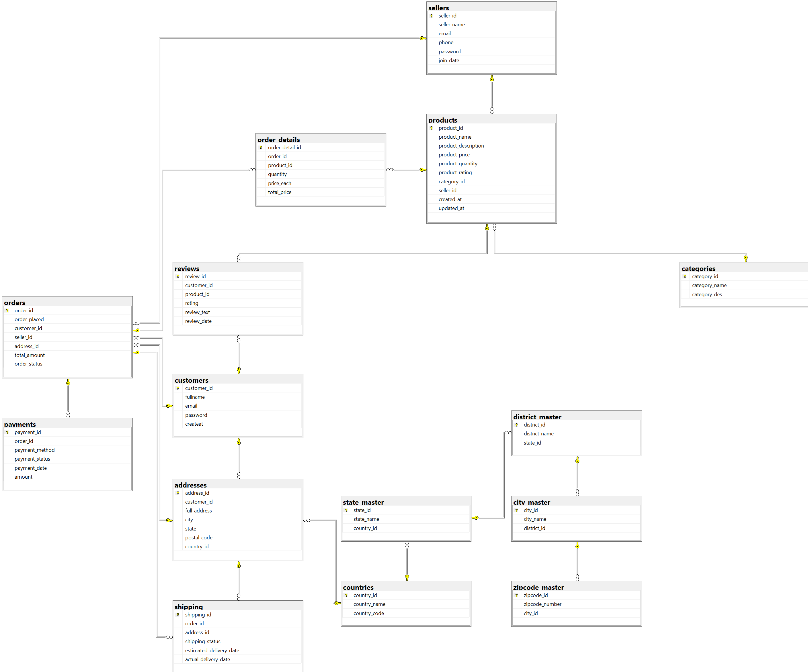

# 🛒 Amazon Database Clone (SQL Project)

This project is a **complete SQL-based simulation of an Amazon-style e-commerce system**, built using **SQL Server Management Studio (SSMS)**.  
It demonstrates my understanding of **database design, normalization (up to 3NF)**, and **data analysis** through SQL queries.

---

## 📊 Database Schema

### ER Diagram

Below is the visual representation of the database schema:



### Key Tables

- **customers**: Stores customer information including name, email, and hashed passwords
- **sellers**: Contains seller details and contact information
- **products**: Product catalog with pricing, quantity, and category information
- **categories**: Product categories and descriptions
- **orders**: Customer orders with status and total amount
- **order_details**: Line items for each order
- **payments**: Payment information for orders
- **shipping**: Shipping details and tracking
- **reviews**: Customer product reviews and ratings
- **addresses**: Customer shipping addresses
- **countries/state_master/district_master/city_master/zipcode_master**: Location hierarchy tables

---

## 🧱 Project Overview

The database represents an **e-commerce platform** similar to Amazon.  
It contains all essential modules like customer management, product listings, orders, payments, shipping, and reviews.

---

## 🏗️ Key Features

- 🧩 **15+ relational tables** covering all e-commerce operations  
- 🔐 **Primary & Foreign Keys** for referential integrity  
- 🧮 **Computed Columns** (e.g., order_details.total_price) and **Check Constraints**  
- 🧾 **3NF Normalization** to minimize redundancy  
- 🛡️ **Secure password hashing** for user authentication  
- 📦 **Inventory management** with product quantities  
- 🌍 **Global address system** with hierarchical location data  
- ⭐ **Review and rating system** for products

---

## 🧰 Technologies Used

| Component | Description |
|------------|-------------|
| **Database** | Microsoft SQL Server |
| **IDE** | SQL Server Management Studio (SSMS) |
| **Language** | T-SQL (Transact-SQL) |
| **Concepts** | RDBMS, Data Normalization (1NF–3NF), Joins, Subqueries |

---

## 📁 Project Structure

**Repository Layout:**

**Amazon-Database-Clone/**
- `Amazon_db_clone.sql` → Main SQL project file  
- `images/Amazon_clone_db_img.png` → ER diagram image  
- `README.md` → Project documentation  

---

## 🧠 Learning Outcomes

Through this project, I learned how to:

- Design normalized relational databases from scratch  
- Use **keys and constraints** effectively  
- Write **analytical SQL queries** for business insights  
- Understand **data relationships** in large-scale systems  
- Apply **real-world logic** in database design  

---

## 💻 Sample Queries

### 🔹 Get Products by Category
```sql
SELECT p.product_name, p.product_price, c.category_name, s.seller_name
FROM products p
JOIN categories c ON p.category_id = c.category_id
JOIN sellers s ON p.seller_id = s.seller_id
WHERE c.category_name = 'Electronics';
```

### 🔹 Customer Order History
```sql
SELECT 
    c.fullname, 
    o.order_id, 
    o.order_placed, 
    o.total_amount,
    o.order_status
FROM customers c
JOIN orders o ON c.customer_id = o.customer_id
WHERE c.email = 'vinay.singh@example.com'
ORDER BY o.order_placed DESC;
```

### 🔹 Top Rated Products
```sql
SELECT TOP 5
    p.product_name,
    AVG(r.rating) as avg_rating,
    COUNT(r.review_id) as review_count
FROM products p
LEFT JOIN reviews r ON p.product_id = r.product_id
GROUP BY p.product_id, p.product_name
HAVING COUNT(r.review_id) > 0
ORDER BY avg_rating DESC, review_count DESC;
```

### 🔹 Monthly Sales Report
```sql
SELECT 
    FORMAT(o.order_placed, 'yyyy-MM') as month,
    COUNT(DISTINCT o.order_id) as total_orders,
    SUM(od.total_price) as total_revenue,
    AVG(od.total_price) as avg_order_value
FROM orders o
JOIN order_details od ON o.order_id = od.order_id
WHERE o.order_placed >= DATEADD(month, -6, GETDATE())
GROUP BY FORMAT(o.order_placed, 'yyyy-MM')
ORDER BY month DESC;
```
